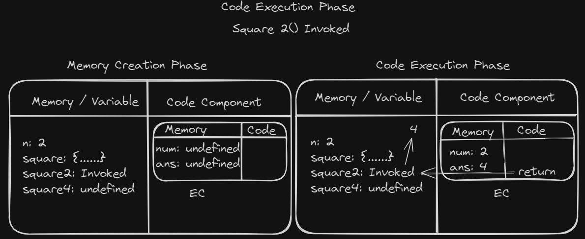
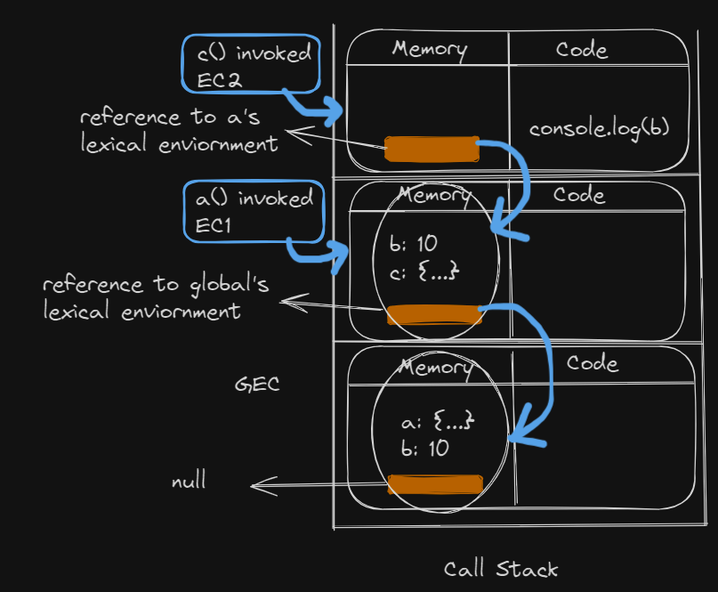

# JavaScript

<!-- To run this file, (ctrl + shift + v -> Preview in new tab, ctrl + k v -> Preview side-by-side)) -->

## Table of Contents

1. [What is JS?](#que-1-what-is-js-)
2. [What is Execution Context?](#que-2-what-is-execution-context-)
3. [How JS works?](#que-3-how-js-works-)
4. [What is the difference Between let, var, and const?](#que-4-what-is-difference-between-let-var-and-const-)
5. [What is TDZ?](#que-5-what-is-tdz-)
6. [Why "let" was introduced or What are the limitations of "var"?](#que-6-why-let-was-introduced-or-what-are-the-limitations-of-var-)
7. [Why and What is Hoisting?](#que-7-why-and-what-is-hoisting-)
8. [What is window in JS?](#que-8-what-is-window-in-js-)
9. [What is the shortest Code in JS?](#que-9-what-is-the-shortest-code-in-js-)
10. [Difference Between "undefined" and "not defined".](#que-10-difference-between-undefined-and-not-defined)
11. [What is Lexical Environment?](#que-11-what-is-lexical-environment-)
12. [What is Event Delegation?](#que-12-what-is-event-delegation-)
13. [What is Scope and Scope Chain?](#que-13-what-is-scope-and-scope-chain-)
14. [What is Block and Block Scope?](#que-14-what-is-block-and-block-scope-)
15. [What is Shadowing and Illegal Shadowing?](#que-15-what-is-shadowing-and-illegal-shadowing-)
16. [What are Falsy Values?](#que-16-what-are-falsy-values-)
17. [Difference Between == and ===](#que-17-difference-between--and-)
18. [What are Primitive and Non-Primitive Values?](#que-18-what-are-primitive-and-non-primitive-values-)
19. [What is Closure?](#que-19-what-is-closure-)
20. [Some Basic Terms](#que-20-some-basic-terms)
21. [What is IIFE?](#que-21-what-is-iife-)
22. [What is the difference between Method and Function?](#que-22-what-is-the-difference-between-method-and-function-)
23. [What is this Keyword?](#que-23-this-keyword)
24. [call, apply & bind](#que-24-call-apply-and-bind)
25. [What is the difference between spread and rest operator ?](#que-25-what-is-the-difference-between-spread-and-rest-operator-)
26. [Difference between arrow funtions and normal funtions.](#que-26-difference-between-arrow-funtions-and-normal-funtions)
27. [What is currying?](#que-27-what-is-currying-)
28. [What is a callback function?](#que-28-what-is-a-callback-function-)
29. [Why to remove Event Listener?](#que-29-why-to-remove-event-listener-)
30. [What are web APIs?](#que-30-what-are-web-apis-)
31. [What is Event Loop & how it works?](#que-31-what-is-event-loop--how-it-works-)
32. [What are Higher Order Functions?](#que-32-what-are-higher-order-functions-)
33. [Polyfill](#que-33-polyfill)
34. [What is callback hell?](#que-34-what-is-callback-hell-)
35. [What are promises?](#que-35-what-are-promises-)
36. [What are Promise APIs?](#que-36-what-are-promise-apis-)
37. [What is async/await?](#que-37-what-is-asyncawait-)
38. [Why we use await with fetch?](#que-38-why-we-use-await-with-fetch-)
39. [How to handle errors in Promises?](#que-39-how-to-handle-errors-in-promises-)
40. [What is finally block?](#que-40-what-is-finally-block-)
41. [Difference between async/await and promise.then?](#que-41-difference-between-asyncawait-and-promisethen-)
42. [What is debouncing & throttling?](#que-42-what-is-debouncing-and-throttling-)
43. [What is Difference between localStorage and sessionStorage](#que-43-what-is-difference-between-localstorage-and-sessionstorage-)
44. [Some output questions](#que-44-some-output-questions)


---

## Que-1: What is JS ?
+ JS is `synchronus single-threaded` language.
+ Everything in JS happens inside `Execution Context`.
+ `Loosely/weakly` typed language (does not attach it's variables to any single data type)

## Que-2: What is Execution Context ?
+ It consists of 2 parts:
  - `Memory or Variable Environment`, where variable and functions are stored in key-value pair.
  - `Code Component or Thread of Execution`, where code is executed.

  

## Que-3: How JS works ?
+ As soon as JS code runs, Execution Context(GEC) is created (before executing first line of the code). 

  

  ```javascript
  var n = 2;
  function square(num) {
    const ans = num * num
    retun ans
  }
  square2 = square(n)
  square4 = square(4)
  ```

Execution Context is created in 2 phases:
  - Memory Creation Phase:
    * Memory is allocated to all the variables and functions.
    * Initial value of variables are set to `undefined`.
    * Initial values of functions are basically `whole function code`.

    
    
  - Code Execution Phase:
    * Assigns the value of variables that is written in code.
    * Invoke the functions.
    * When function is invoked, again `execution context(EC) is created` but in Code component.
    * Then execution context will be created in 2 phase(same as before).
    * Whenever return statement is executed, `EC in code component will be destroyed`.
    * Control will be back to GEC from EC.

    
    

+ All the process are handled using `call-stack`(maintains the order of execution of execution contexts) and at the bottom GEC is present.
+ Once full code is executed, `GEC is destroyed`.

## Que-4: What is difference between let, var and const ?
+ var:
  - It is is `hoisted and not in TDZ(Temporal deadzone)`
  - Can be `re-declare` and `re-assign`.
  - `Global scope` or `function scope`
  - window.variableName -> value
+ let:
  - It is is `hoisted and in TDZ(Temporal deadzone)`
  - `Can't be re-declare` but can be `re-assign`.
  - Block Scope
  - window.variableName -> undefined
+ const:
  - It is is `hoisted and in TDZ(Temporal deadzone)`
  - `Can't be re-declare and re-assign`.
  - `Block Scope`
  - window.variableName -> undefined
  - It should be defined or intialised at the time of declaration.
  - Can be modified.
    ```javascript
    const a = []
    a.push(1, 2) // [1, 2]
    ```

## Que-5: What is TDZ ?
+ The period from when a let or const variable is `hoisted (declared)` to when it is `initialized (assigned a value)`.
+ During this time, the variable exists in a `different space(Script)` where it cannot be accessed until it is assigned a value.
+ Varibales can be accessed once some value is `intialised` to that variable.

  

  ```javascript
  console.log(b)
  console.log(a)

  let a = 10;
  var b = 100;
  ```
  ```
  Output:
  100
  ReferenceError: Cannot access 'a' before initialization
  ```

## Que-6: Why let was introduced or What are the limitations of var ?
+ Lack of Block Scope:
  - var is not block-scoped, meaning variables declared within a block (e.g., inside if, for, or while blocks) are actually scoped to the containing function or the global scope.
    <table>
      <tr>
        <th>Var</th>
        <th>Let</th>
      </tr>
      <tr>
        <td>

    ```javascript
    if (true) {
      var x = 5;
    }
    console.log(x);
    // 5
    // x is accessible outside the if block

    ```

    </td>
        <td>

    ```javascript
    if (true) {
      let y = 5;
    }
    console.log(y);
    // ReferenceError: y is not defined

    ```

    </td>
    </tr>
    </table>
+ Hoisting Confusion:
  - Hoisting can lead to unexpected behaviors, where variables seem to be used before they are declared.

    ```javascript
    console.log(b)
    console.log(a)

    let a = 10;
    var b = 100;
    ```
    ```
    Output:
    100
    ReferenceError: Cannot access 'a' before initialization
    ```
+ Re-declaration:
  - Can lead to unintended overwrites and bugs.
    <table>
      <tr>
        <th>Var</th>
        <th>Let</th>
      </tr>
      <tr>
        <td>

    ```javascript
    var x = 5;
    var x = 10; // No error, x is re-declared

    ```

    </td>
        <td>

    ```javascript
    let a = 5;
    let a = 10; // SyntaxError: Identifier 'a' has already been declared

    ```

    </td>
    </tr>
    </table>

## Que-7: Why and what is Hoisting ?
+ It happens of because of `Memory Creation Phase`.
+ It is `phenomenon by which variables and function can be access before they are intialised`.
  <table>
    <tr>
      <th>Actual</th>
      <th>How JS reads</th>
    </tr>
    <tr>
      <td>

  ```javascript
  console.log(x)
  xprint()

  var x = 10;
  function xprint(){
    console.log("Hello")
  }

  ```

  </td>
      <td>

  ```javascript
  var x;
  function xprint(){
    console.log("Hello")
  }

  console.log(x)
  xprint()

  x = 10;

  ```

  </td>
  </tr>
  </table>

  

+ As we can see, before executing line no 3, we already have x as undefined and print() in global scope execution context(GEC)(right-side) and we can also see call-stack(left-side)

  

NOTE: Arrow functions behaves as variable that's why we will get undefined if we ill call functio before declaration.

## Que-8: What is window in JS ?
+ Window is a `global object` created by `JS engine` in `global space`.
+ Variables and functions which are not declared inside any function are in global space and can be accessed via `window` or `this` keyword.

  ```javascript
  console.log(a) // "undefined" because of hoisting
  var a = 10;
  function abc(){
    var x = 10
  }

  console.log(a) // 10
  console.log(window.a) // 10
  console.log(this.a) // 10
  console.log(x) // Reference error: x is not defined. Why ?
  // x is present inside function not in global scope.
  ```

## Que-9: What is the shortest code in js ?
+ No code. why ?
+ As soon JS code runs, GEC is created.

## Que-10: Difference between undefined and not defined.
+ The value is undefined when that particular variable is declared but no definition.<div style="padding-left:50px;">OR</div>
`Memory is allocated but no value is present so by default JS allocates undefined (Memory Creation Phase)`.
+ The value is not defined when that particular variable is not declared in required space or scope(can be global space or function space). <div style="padding-left:50px;">OR</div>
  `Memory is not allocated for that particular variable`.

## Que-11: What is lexical environment ?
+ It is `local memory` along with reference to `lexical environment of parent`.
+ It is created along with EC and is `present inside every EC`.
+ In below example, c() is lexcially inside a().
  
  ```javascript
  function a(){
    c()
    function c(){
      console.log(b)
    }
  }

  var b = 10;
  a()
  ```

+ `How it works ?`
  - Global Execution Context (GEC):

    1. Created as soon as the JavaScript code starts executing.
    2. Pushed to the bottom of the call stack.
    3. Contains a reference to the parent lexical environment, which is null.

  - Function Invocation and Execution Context (EC):

    4. When a() is invoked, a new execution context (EC1) is created.
    5. EC1 has a reference to the GEC's lexical environment.
    6. When c() is invoked within a(), another execution context (EC2) is created.
    7. EC2 references EC1's lexical environment.

  + Lexical Environment Search:

    8. Inside c(), when console.log(b) is encountered, the search for b begins in EC2.
    9. If b is not found in EC2's local memory, the search continues in EC1.
    10. If still not found, the search moves to GEC's local memory.

  + Variable Resolution:

    11. If b is found at any level of the lexical environment, its value is printed.
    12. If b is not found in GEC either, a ReferenceError: b is not defined is thrown.

  
  
  

## Que-12: What is Event Delegation ?
+ A technique for handling events that involves adding a single event listener to a parent element rather than adding event listeners to individual child elements.

  - `Event Capturing`
    - Event propagates from the `top of the document` `down` to the element on which the `event occurred`.

  - `Event Target`
    - Event handler is `executed` on the element on which the `event occurred` and can be `assessed via event.target`.

  - `Event Bubbling`
    - Event moves `back up the DOM` tree from the element where the `event occurred` to `its parent element`, and so on, until it reaches the top of the document.

    - This is the `default behavior` for most events in the DOM.

    - Reverse of capturing phase.


```html
<!-- HTML -->

<body>
  <div id="nav" className="styleHeader">
    <span>Header</span>
    <button type="button" id="logout">
      Log Out
    </button>
  </div>
  <script src="./index.js" />
</body>
```

```javascript
const nav = document.getElementById("nav") // parent
const logout = document.getElementById("logout") // child
```
```javascript
// event capturing
nav.addEventListener("click", () => {
  console.log("Navbar Clicked");
}, true)

logout.addEventListener("click", () => {
  console.log("Logout clicked");
})
```
```javascript
// clicked on logout button (child)

Navbar Clicked
Logout Clicked
```

```javascript
nav.addEventListener("click", () => {
  console.log("Navbar Clicked");
})

// event bubbling
logout.addEventListener("click", () => {
  console.log("Logout clicked");
})
```
```javascript
// clicked on logout button (child)

Logout Clicked
Navbar Clicked
```
```javascript
// Problem in event bubbling
// If same type of event is attached in parent and child
// and child's event is triggered, the event also propagates to the parent element.

// solution-1 -> event.stopPropagation

logout.addEventListener("click", (e) => {
  console.log("Logout clicked");
  e.stopPropagation()
})

// solution-2 -> event delegation

nav.addEventListener("click", (e) => {
  if (e.target.id === 'logout') {
    console.log("Logout clicked via event delegation");
  } else {
    console.log("Navbar Clicked via event delegation");
  }
});
// remove the listener from logout
```
```javascript
// clicked on logout button

Logout Clicked
Logout clicked via event delegation
```
## `Use case of`
  + `event.stopPropagation`
    - Imagine you have a notification popup that includes a "Close" button to dismiss the notification. However, the popup itself also has a click event to trigger actions, like displaying or hiding the popup.
    ```html
    <style>
      .notification {
        padding: 20px;
        background-color: #f8d7da;
        border: 1px solid #f5c6cb;
        border-radius: 5px;
        position: relative;
        width: 200px;
      }
      .close-btn {
        position: absolute;
        top: 10px;
        right: 10px;
        background: red;
        color: white;
        border: none;
        border-radius: 50%;
        width: 20px;
        height: 20px;
        text-align: center;
        line-height: 20px;
        cursor: pointer;
      }
    </style>
    <body>
      <div class="notification">
        <button class="close-btn">×</button>
        <p>This is a notification message.</p>
      </div>

      <script src="./index.js"></script>
    </body>
    ```
    ```javascript
    // Select the notification and close button
    const notification = document.querySelector('.notification');
    const closeButton = document.querySelector('.close-btn');

    // Add click event to the notification
    notification.addEventListener('click', () => {
      console.log('Notification clicked');
    });

    // Add click event to the close button with stopPropagation
    closeButton.addEventListener('click', (e) => {
      console.log('Close button clicked');
      e.stopPropagation();  // Prevents the click event from reaching the notification
    });
    ```
    ```javascript
    // close button is clicked
    Close button clicked
    ```
  + `event delegation`
    - Imagine you have a list of items and you want to perform the same action on all of them without adding individual event listeners to each item.
    ```html
    <body>
      <ul id="myList">
        <li>Item 1</li>
        <li>Item 2</li>
        <li>Item 3</li>
        <li>Item 4</li>
      </ul>
      <script src="./index.js"></script>
    </body>
    ```
    ```javascript
    const myList = document.getElementById('myList');

    // Event delegation: Add a single event listener to the parent (ul)
    myList.addEventListener('click', (e) => {
      if (e.target.tagName === 'LI') {  // Check if the clicked element is an LI
        alert(`Clicked on ${e.target.textContent}`);
      }
    });
    ```
    

## Que-13: What is scope and scope chain ?
+ Scope is where we can access specific variable or a function in our code.
+ Scope chain is a mechanism by which JS resolves variable references by looking up the chain of lexical environments.

## Que-14: What is block and block scope ?
+ `Group multiple statements togather` in a block, so that we can use it where JS expects one/single statement.

  ```javascript
  {
    if(true) true;
    // What if we want to execute multiple statement under "if"

    if(true){
      // Write inside block
    }
  }
  ```

+ Block scope is `whatall variables and functions` we can access inside any particular block.
  - var can be accessed outside of the block scope, let & const can't.
  ```javascript
  {
    var a = 1;
    let b = 2;
    const c = 3;
  }
  ```
  

## Que-15: What is shadowing and illegal shadowing ?
+ Shadowing occurs when a variable declared within a certain scope (e.g., a function or a block) has the same name as a variable declared in an outer scope.
+ The inner variable `shadows` the outer variable, meaning the inner variable takes `precedence` within its scope.
+ Illegal shadowing occurs when a let or const variable shadows a variable declared with var in the same scope.

  ```javascript
  // Shadowing
  var a = 10
  {
    var a = 1;
    console.log(a) // 1
  }
  console.log(a) // 1

  // Illegal shadowing
  let b = 1
  {
    var b = 2 // SyntaxError: Identifier 'b' has already been declared
  }
  ```

## Que-16. What are Falsy Values ?
+ Values that convert to false in a Boolean context.
```javascript
console.log(Boolean(false));       // false
console.log(Boolean(0));           // false
console.log(Boolean(-0));          // false
console.log(Boolean(0n));          // false
console.log(Boolean(""));          // false
console.log(Boolean(null));        // false
console.log(Boolean(undefined));   // false
console.log(Boolean(NaN));         // false
```

## Que-17: Difference between == and ===

+ `==`
  - loose equality `with type coercion`
  - JS will attempt to convert one or both values to the same type before making the comparison

+ `===`
  - strict equality `without type coercion`

+ `Rules of coercion`

  - If one operand is a `string` and the other is a
   `number`, JavaScript converts the `string to a number`.
    ```javascript
    // String to Number
    console.log('5' == 5);  // true: '5' is converted to 5
    ```

  - If one operand is a `Boolean` and the other is a `number`, the `Boolean is converted to a number` (true becomes 1 and false becomes 0).
    ```javascript
    // Boolean to Number 
    console.log(true == 1); // true: true is converted to 1
    console.log(false == 0); // true: false is converted to 0
    ```

  - If one operand is an `object` and the other is a `primitive` value, JavaScript tries to `convert the object to a primitive` using the object's valueOf() and toString() methods.
    ```javascript
    // Object to Primitive
    console.log([] == '');  // true: [] is converted to "" which equals ""
    ```

  - In `+`, if `one of the operands is a string`, the other operand is `converted to a string` and `concatenation` occurs.
    ```javascript
    // Addition (+ Operator)
    console.log('5' + 1); // '51': 1 is converted to a string and concatenated
    console.log(5 + 1) // 6
    console.log("5" + "1") // '51'
    ```

  - In `-, *, /`, `Strings` are `converted to numbers`. If conversion fails, NaN is the result.
    ```javascript
    // Other Arithmetic Operators (-, *, /)
    console.log('5' - 1); // 4: '5' is converted to 5 and subtracted
    console.log('5' * 2); // 10: '5' is converted to 5 and multiplied
    console.log('5' / 2); // 2.5: '5' is converted to 5 and divided
    console.log('5' * '2'); // 10: '5' and '2' are both converted to numbers

    ```

 ```javascript
  console.log(5 == "5");          // true: "5" is coerced to 5
  console.log(0 == false);       // true: false is coerced to 0
  console.log(null == undefined); // true: null and undefined are considered equal
  console.log([] == false);      // true: [] is coerced to false
  console.log([] == ![]);        // true: [] coerces to false, and ![] coerces to false
  console.log(0 == '');         // true: '' is coerced to 0
  console.log(false == 'false'); // false: different types
  console.log(NaN == NaN);   // false: NaN is not equal to anything, including itself
  console.log([] == []);   // false: different objects in memory
  console.log({} == {});   // false: different objects in memory
  console.log(5 === "5")   // false: 5 is number type and "5" is tring type
```

## Que-18: What are primitive and non-primitive values ?
+ `Primitive`

  - Also know as `in-built data types`.
  - `Immutable`, once a value is created, it cannot be changed, although the variable that holds it may be reassigned another value.
  - When you assign a primitive value to a variable, you are working with the actual value itself.
  ```javascript
  let name = "ABC"  // String
  let age = 20   // Number
  let isStatus = true  // Boolean
  let value1 = null // Null
  let value2 // Undefined
  ```

+ `Non-Primitive`
  - Also know as `reference data type` or `derived data type`.
  - Derived from primitive data type.
  - `Mutable`, which means their values can be changed once created.
  - When you assign a non-primitive value to a variable, you are working with a reference to the value, not a copy.
  ```javascript
  let obj = {a: 1, b: 2}  // Object
  let arr = [1, 2, 3, 4]  // Array (type fo object)
  funtion fn(){}          // Funtion
  const date = new Date() // Date
  ```

## Que-19: What is closure ?
+ `Function` along with `it's lexical enviornment`.

    ```javascript
  function x(){
      var a = 10;
      function y(){
        console.log(a) // 10
      }
      return y // not just function y was returned, it's lexical enviornmet was also returned
  }
  // At this moment x is destroyed
  var z = x()
  console.log(z())
  // We will still get 10 because of closure.
  ```

  - How "y" was able to access variable declared in "x" ?
    - Bceause of lexical scope or lexical environment.
    - First JS searches in y, if not present, searches in parent(x), How ?
    - In y's memory JS also creates reference to parent's(x's) lexical environment. 

  

## Que-20: Some basic terms.
+ Function Expression:
  ```javascript
  // A function which is used as value.
  // Hoisted

  var b = function (){

  }
  ```
+ Function Declaration / Statement:
  ```javascript
  A function with a specified name
  // Hoisted

  function ABC(){

  }

  ```
+ Anonymous Function:
  ```javascript
  // A function with no name.
  // Can't use directly below expression, can be used with expression.
  // SyntaxError: Function statements require a function name
  // Used as values (function expression)

  function (){

  }
  ```
+ Named Function Expression:
  ```javascript
  // A function expression with function name.

  var b = function ABC(){
    
  }
  b() // correct
  ABC() // ReferenceError: ABC is not defined
  ```
+ Parameters & Arguements:
  ```javascript
  function ABC(x){     // x is parameter
    connsole.log(x)
  }
  ABC(x)        // x is arguement
  ```
+ First Class Functions / First Class Citizens:
  ```javascript
  // The ability to use functions as value

  var b = function(p){
    console.log(p);        // ƒ xyz(){}
  }
  function xyz(){}
  b(xyz)

  var b = function (){
    return function (){
      console.log("A")    // ƒ (){console.log("A")}
    }
  }
  console.log(b())
  ```

+ `Arrow Funtion`
  - Named function  expression with arrows.
  - `no arguments`
  - use `spread(...)` operator to use arguements
  - don't have their own `this`.
  - No hoisting

  ```javascript
  const x = function (){
    console.log("ABC")
  }

  const y = () => {
    console.log("ABC")
  }
  ```
## Que-21: What is IIFE ?

+ `Immediately Invoked Function Expression`

+ A function expression that is `executed immediately` after its creation.

  ```javascript
  (function() {
    // Code to be executed immediately
  })()

  (function ABC() {
    // Code to be executed immediately
  })()

  (() => {
    // Code to be executed immediately
  })
  ```

## Que-22: What is the difference between method and function ?
+ A funtion which is a part/member/property of an object is method.
  ```javascript
  const obj = {
    name: "Kuch bhi",
    x: function (){
      console.log("method")
    }
  }
  // x() is method

  function y(){
    console.log("Function")
  }
  // y() is function
  ```

## Que-23: this keyword.
+ Keyword which is a reference to the object context in which the function is executed.
+ Depends on how the function is called.
+ In `global scope`:
  ```javascript
  console.log(this) // globalObject
  // In JS, we will get window
  // in node, we will get global
  ```

+ In `funtion scope`:

  - In `strict` mode:

    ```javascript
    "use strict"

    function x(){
      console.log(this)
    }
    x()          // undefined
    window.x()   // window (globalObject)
    ```
  - In `non-strict` mode:
    ```javascript
    function x(){
      console.log(this)  // window
    }
    x()
    // because of "this substituion"
    // when this's value is undefined, the value will be replaced with globalObject
    ```

+ In `arrow function`:
  ```javascript
  // don't have their own this
  // instead it retains the 'this' value of enclosing lexical context

  const obj = {
    a: 10,
    x: () => {
      console.log(this)
    }
  }
  obj.x() // window (globalObject)

  // lexical context of x is where obj is present, i.e., global scope

  const obj2 = {
    a: 10,
    x: function(){
      const y = () => {
        console.log(this)
      }
      y()
    },
    // abc: () => {
    //  console.log(this) // globalObject
    //}
  }
  const obj3 = {
    a: 10,
    x: function(){
      console.log(this)
    }
  }
  // x() inside obj2 and obj3 will behave the same way
  obj2.x() // { a: 10, x: f }
  obj3.x() // { a: 10, x: f }

  // lexical context of y is where x is present, i.e., obj2
  ```

+ In `object's method`:
  ```javascript
  const obj = {
    a: 10,
    x: function (){
      console.log(this)  // {a: 10, x: f}
    } 
  }
  obj.x()
  // this will act same as obj
  // this.a // 10
  // obj.a // 10
  ```

+ In `DOM` elements:
  ```html
  <!-- reference to HTMLelement that received the event -->

  <button onclick="alter(this)"></button> 
  <!-- [object HTMLButtonElement] -->
  ```

## Que-24: call, apply and bind.
+ `call`
  - function borrwoing

  ```javascript
  const student = {
    name: "A",
    printName: function (){
      console.log(this.name)
    }
  }

  student.printName() // A

  const student2 = { name: "B" }

  student.printName.call(student2) // B

  // will override the value of this from student to student2
  ```
+ `apply`
  - same as `call`
  - will passs econd arguement as array
  ```javascript

  const printInfo = function (hometown, state){
    console.log(this.name + " from " + hometown + ", " + state)
  }

  const student = { name: "A" }

  printInfo.call(student, "XYZ", "MP")      // A from XYZ, MP
  printInfo.apply(student, ["XYZ", "MP"])   // A from XYZ, MP

  ```
+ `bind`
  - create a copy of function
  - bind the object to copied function
  - return the copied function, which can be invoked later
  - 2 step process
  ```javascript
  const printInfo = function (hometown, state){
    console.log(this.name + " from " + hometown + ", " + state)
  }
  const student = { name: "A" }

  const bindFunction = printInfo.bind(student, "XYZ", "MP")
  bindFunction()              // A from XYZ, MP
  // or
  printInfo.bind(student, "XYZ", "MP")()    // A from XYZ, MP
  printInfo.call(student, "XYZ", "MP")      // A from XYZ, MP
  printInfo.apply(student, ["XYZ", "MP"])   // A from XYZ, MP
  
  ```

## Que-25: What is the difference between spread and rest operator ?

+ `spread`

  - used to `expand elements`

  ```javascript
  const arr1 = [1, 2, 3, 4, 5]
  const arr2 = [...arr1]
  consooe.log(arr2) // [1, 2, 3, 4, 5]
  console.log(Mat.max(...arr1)) // 5

  // Merging Arrays
  const fruits = ['apple', 'banana'];
  const vegetables = ['carrot', 'broccoli'];
  const allFoods = [...fruits, ...vegetables];
  console.log(allFoods); // ["apple", "banana", "carrot", "broccoli"]

  // Cloning an Array
  const originalArray = [1, 2, 3];
  const clonedArray = [...originalArray];
  console.log(clonedArray); // [1, 2, 3]

  // Copying an Object
  const person = { name: 'Alice', age: 30 };
  const updatedPerson = { ...person, age: 31 };
  console.log(updatedPerson); // { name: 'Alice', age: 31 }
  ```

+ `rest`

  - collect multiple elements into `an array/object`.

  ```javascript
  cons [first, ... rest] = [1, 2, 3, 4, 5]
  console.log(first) // 1
  console.log(rest) // [1, 2, ,3 , 4, 5]

  // Function with Variable Arguments
  function joinStrings(separator, ...strings) {
    return strings.join(separator);
  }
  console.log(joinStrings(', ', 'apple', 'banana', 'cherry')); // "apple, banana, cherry"

  // Destructuring Arrays
  const [first, second, ...others] = [1, 2, 3, 4, 5];
  console.log(first);  // 1
  console.log(second); // 2
  console.log(others); // [3, 4, 5]

  // Destructuring Objects
  const { name, ...details } = { name: 'Bob', age: 25, city: 'Chicago' };
  console.log(name);   // Bob
  console.log(details); // { age: 25, city: 'Chicago' }
  ```

## Que-26: Difference between arrow funtions and normal funtions.

+ `Syntax`

  ```javascript
  function a(){
    console.log("A")
  }
  a()

  const b = () => {
    console.log("B")
  }
  b()

  function sum(x, y){
    return x + y
  }

  console.log(sum(2, 3))
  const sumArrow = (x, y) => x + y
  console.log(sumArrow(3, 4))
  ```
  ```javascript
  A
  B
  5
  7
  ```

+ `Arguments`
  ```javascript
  function arg(){
    console.log(arguments)
  }
  arg(1, 2, 3, 4, 5)

  // no'arguments' keyword
  // use spread(...) operator
  const argArrow = (...arguments) => {
    // 'arguments' is user defined
    // name can be anything
    console.log(arguments)
  }
  argArrow(1, 2, 3, 4, 5)
  ```
  

+ `Hoisting`
  ```javascript
  // arrow funtions are not hoisted

  a()
  b()
  function a(){
    console.log("A")
  }

  const b = () => {
    console.log("B")
  }
  ```
  ```javascript
  A
  Uncaught ReferenceError: Cannot access 'b' before initialization
  ```

+ `this`
  + [arrow function](#que-23-this-keyword)

## Que-27. What is currying ?
+ Technique in which a function is transformed into a sequence of functions, each taking a single argument.
```javascript
// creating multiplication of 2 and 3
// using closure
function multiply(x){
  return function (y){
    console.log(x * y)
  }
}

const multiplyByTwo = multiply(2) // x = 2
multiplyByTwo(5)  // 10 // y = 5
multiply(2)(5)    // 10 // x = 2, y = 3

const multiplyByThree = multiply(3) // x= 3
multiplyByThree(5) // 15 // y = 5
multiply(3)(5)     // 15 // y = 5
```

## Que-28: What is a callback function ?
+ The function which is passed as arguemet to another function.

  ```javascript
  function x(y){

  }
  x(function y(){})

  // function y is callback function
  // bceause it will be called after sometime (when x wants to.)
  // Ex- setTimeout(callback, timer)
  ```

## Que-29: Why to remove Event Listener ?
+ Since Event Listener form a closure, they are taking space in memory.

## Que-30: What are web apis ?
+ setTimeout() `// not a part of js`
+ DOM APIs (getElementsById, etc)
+ fech()
+ loalStorage
+ console

## Que-31: What is Event Loop & how it works ?
+ A mechanism that allows the program to handle multiple tasks (like user inputs, network requests, or timers) without blocking the main thread.

+ How it works ?
  - **Global Execution Context (GEC)**: As soon as JavaScript runs, a Global Execution Context `(GEC) is created` and `pushed onto the call stack`.

  - **Synchronous Code Execution**: JavaScript starts executing code line by line in a `synchronous manner`.

  - **Handling `setTimeout`**: When `setTimeout()` is encountered, JavaScript requests the `browser` to handle the timer using the `Web API`. The timer starts counting down.

  - **Handling `fetch`**: When `fetch()` is encountered, JavaScript requests the `browser` to perform the fetch operation using the `Web API`. The browser sends the request to the server for the API.

    

  - **Callback Queue and `setTimeout`**: After the timer completes, the callback function for `setTimeout` (let's call it `cbT`) is pushed to the `callback queue (also known as the task queue or macrotask queue)`.
    - The `callback queue` in JavaScript's event loop is where macrotasks (callbacks) are stored for execution. These tasks are generally `lower-priority` compared to microtasks and are `executed after all microtasks in the microtask queue have been processed`.
    - Types of Tasks in the Callback Queue:
      - `setTimeout`
      - `setInterval()`
      - `UI Rendering (DOM APIs)`

  - **Microtask Queue and `fetch`**: When the browser receives the API response, the callback function for `fetch` (let's call it `cbF`) is pushed to the `microtask queue (also known as the job queue)`.
    - The `microtask queu`e is a `priority queue` in the JavaScript event loop mechanism that `holds microtasks`, which are typically `high-priority tasks` that need to be `executed immediately after the current synchronous code and before any macrotasks (callbacks)` from the callback queue.
    - Types of Tasks in the Microtask Queue:
      - `Promises`
      - `Mutation Observer (A mechanism to listen for changes in the DOM)` 

    

  - **Continuing Execution**: In the meantime, JavaScript continues executing the remaining synchronous code. Once all synchronous code has been executed, the `GEC is popped from the call stack`.

    

  - **Event Loop Operation**:
    - The `event loop continuously checks` if the call stack is empty.
    - If the `call stack is empty`, it `first checks the microtask queue`.
    - If there are tasks in the microtask queue, they are pushed to the call stack and executed.
    - After the `microtask queue is empty`, the `event loop checks the callback queue`.
    - If there are tasks in the callback queue, they are pushed to the call stack and executed.

    

    

  - **Rechecking**: After executing a task from either queue, the event loop repeats the process:
    - It checks if the call stack is empty.
    - It checks the microtask queue first, and then the callback queue if the microtask queue is empty.

    

## Que-32: What are Higher Order Functions ?
+ A `function` that `takes another function` as an `arguement` or `returns a function` from it.

  ```javascript
  function x(){
    console.log("Hello")
  }
  function y(x){
    x()
  }

  // y is HOF
  // x is callback function
  ```

## Que-33: Polyfill.
+ A piece of code used to provide `modern functionality` on `older browsers` that do not natively support it.

+ `Polyfill of map`
  ```javascript
  const radius = [3, 1, 2, 4]

  const area = function (radius){
    return Math.PI * radius * radius
  }

  Array.prototype.calculate = function (logic){
    const output = []
    for(let i = 0; i < this.length; i++){
      output.push(logic(this[i]))
    }
    return output
  }

  console.log(radius.map(area))
  console.log(radius.calculate(area))
  ```

+ `Polyfill of filter`
  ```javascript
  const numbers = [3, 1, 2, 4]

  const even = function (number){
    return number % 2 === 0
  }

  Array.prototype.checkEven = function (logic){
    const output = []
    for(let i = 0; i < this.length; i++){
      if(logic(this[i]))
        output.push(this[i])
    }
    return output
  }

  console.log(numbers.filter(even))
  console.log(numbers.checkEven(even))
  ```

+ `Polyfill of reduce`
  ```javascript
  const numbers = [3, 1, 2, 4]

  const sum = function (number, acc){
    return acc + number
  }

  Array.prototype.calculateSum = function (logic, acc){
    let result = acc;
    for(let i = 0; i < this.length; i++){
      result = logic(this[i], result)
    }
    return result
  }

  console.log(numbers.reduce(sum, 0))
  console.log(numbers.calculateSum(sum, 0))
  ```

## Que-34: What is callback hell ?
+ `Callback function inside another callback function`.
+ Structure is know as pyramid of doom.

  ```javascript
  api.createOrder(function (){
    api.proceedToPayment(function(){
      api.showOrderSummary(function(){
        api.updateWallet()
      })
    })
  })
  ```
  - Since proceedToPayemnt() is now handled by another function, i.e, createOrder().
  - There may be a case that proceedToPayment() was `never called` or it was `called multiple times`.
  - This is known as `Inversion Of Control`.
  - Solution-> `Promise`


## Que-35: What are promises ?
+ Objects that represent the `eventual completion or failure` of an `asynchronous operation` and its resulting value.
+ Used to handle asynchronus operations in JS.
+ State of promise:

  - `Pending`: The initial state, neither fulfilled nor rejected.

  - `Fulfilled`: The operation completed successfully.

  - `Rejected`: The operation failed.

  
  ```javascript
  const prmoise = createOrder()
  ```
    - Once promise is resolved
    - then only proceedToPayment() will be called

  ```javascript
  // consuming the promise

  promise
    .then(function(orderId){
      return proceedToPayment(orderId)
    })
    .then(function (paymentInfo){
      return showOrderSummry(paymentInfo)
    })
    .then(function (paymentInfo){
      return updateWallte(paymentInfo)
    })
  ```
  - These chains of '.then' are knonw as `promise chain`.
  - "return" is neccessary to pipe the data. 

  ```javascript
  // Can be written using arrow function

  promise
    .then(orderId => proceedToPayment(orderId))
    .then(paymentInfo => showOrderSummry(paymentInfo))
    .then(paymentInfo => updateWallte(paymentInfo))

  ```
  ```javascript
  // creating promise

  function createOrder(){
    pr = new Promise((resolve, reject) => {
      if(!true){
        const orderId = "1234"
        resolve(orderId)
      }
      else{
        const err = new Error("Cart not valid")
        reject(err)
      }
    })

    return pr
  }

  // consuming promise

  createOrder()
    .then(data => console.log(data))   // 1234
    .catch(error => console.log(error.message)) // Cart not valid
  ```

## Que-36: What are promise APIs ?
+ Promise.all([p1, p2, p3])

  - used to call multiple apis parallely.
  - no. of promises present inside array = no of api calls
  - execution time = MaxExectutionTime([p1, p2, p3])
  - suppose p2 fails after 1 sec, so, after 1 sec ,promise.all() will be rejected & error of p2 will be consoled
  - rejected if any one of the promise is failed.

+ Promise.allSettled([p1, p2, p3])

  - Almost same as Promise.all([])
  - Hanldes the case if one of the promise gets failed.
  - suppose p2 fails, so after 3secs(max execution time), it will return [val1, err2, val3]
  - Output will always be an array.

+ Promise.race([p1, p2, p3])
  - output will be the result (resolved value or rejection reason) of the first settled promise, whether it is resolved or rejected.
  - suppose p2 takes 3 sec for settling, the after 3 sec, weather it is success or failuer, output will be returned.

+ Promise.any([p1, p2, p3])
  - wait for first success and return that value
  - suppose p2 fails after 2 sec, nothing will happen, will wait for first success
  - suppose if p2 succeded after 3 sec, will return result of p2.
  - if all failfs, `AggregateError` will be thrown.
  - will also get all errors using `err.errors`

+ Summary
  - `Promise.all` waits for all promises to resolve, and rejects if any promise rejects.
  - `Promise.race` resolves or rejects as soon as any promise resolves or rejects.
  - `Promise.allSettled` waits for all promises to settle (either resolve or reject) and provides the results of all promises.
  - `Promise.any` resolves as soon as any promise resolves, and rejects only if all promises reject.

## Que-37: What is async/await ?
+ `Async`:

  - `keyword` to create `asynchronus function`
  - Always `return promise`.

+ `Await`:

  - can only be used `inside async function`
  - `always written in front of promise`.

+ `Aync + Await`:

  - used to `handle promises`.
  - provides a more synchronous and linear approach to writing asynchronous code

```javascript
  const p = new Promise((resolve, reject) => {
  resolve("Hello World")
  })

  async function ABC(){
    return p
  }

  async function XYZ(){
    const data = await p
    console.log(data);
    return data
  }

  const promise = ABC()

  promise.then(data => console.log(data))

  const promise2 = XYZ()

  promise2.then(data => console.log(data))

  console.log(promise2); // return promise

  ```
  

## Que-38: Why we use await with fetch ?
+ Since `fetch` returns a `promise`, we can use aync + await to handle api response.

  ```javascript
  function handleResponse(){
    // fetch() returns Promise(response object)
    // response contains body which is readable stream
    // response.json() resturn Promise(jsonValue) // convert reponse body to json
    const response = fetch("Some url")
    const data = await response.json()
  }
  ```

## Que-39: How to handle errors in Promises ?
+ If using `async/await`, use `try-catch` block
+ If using without aync/await, use `.then` and `.catch`

## Que-40: What is finally block ?
+ Contains code that will run regardless of whether
  - an exception was thrown or not.
  - try/.then or catch `return` statement or not
+  Ideal for `cleanup code`, such as `closing popups or files` or `resetting variables`, which should execute no matter what happens in the try or catch blocks.
```javascript
fetch()
.then(data => {
  isPopup = false
  console.log("Success")
})
.catch(err => {
  isPopup = false
  console.log("Failed")
})
.finally(() => {
  console.log("Always run")
  isPopup = false
})

// using async/await

try{
  const response = await fetch()
  cons data = await response.json()
  console.log("Success")
  isPopup = false
}
catch(e){
  console.log("Failed")
  isPopup = false
}
finally{
  console.log("Always run")
  isPopup = false
}

```
```javascript
// if no error
Success

// if error
Failed

Always run
// isPopup will be set to true
----------------------------------------------------------

// async/await

// if no error
Success

// if error
Failed

Always run
// isPopup will be set to true
```

## Que-41: Difference between async/await and promise.then ?

+ `No difference` in terms of execution.
+ JS treats async/await as promises.then only.
+ async/await just gives better readability to code.

## Que-42: What is debouncing and throttling ?

+ `Debouncing`
  - A technique used to limit the frequency of a function's execution.

  - Ensures that a function is executed only after a certain delay has passed since the last time it was invoked.

  - If the function is called again before the delay period ends, the previous timer is cleared, and a new timer is started.

  - The function is executed only if it is not called again within the specified delay period.

  - Ex - Input Search field, button click

+ `Throttling`

  - A technique used to limit the frequency of a function's execution.

  - Ensures that a function is called at most once in a specified period.

  - It is like `setInterval()`.

  - Will call the function continuously after certain delay, if that function is being called again and again.

  - If the time since the last execution is `less` than the specified delay, the function call is `ignored`.

  - If the time since the last execution is `greater` than or equal to the delay, the function is `executed`.

  - Ex - Scroll behaviour

  `Create a button and count the button pressed and page scrolled using debounce and throttle`
  ```html
  <!DOCTYPE html>
  <html lang="en">

  <head>
    <meta charset="UTF-8">
    <meta name="viewport" content="width=device-width, initial-scale=1.0">
    <title>Document</title>
  </head>
  <style>
  body {
    height: 200vh;
  }
  main {
    position: fixed;
  }
  .section2{
    margin-top: 100px;
  }
  </style>

  <body>
    <main>

      <button id="inc" onclick="">Increment</button>

      <section>
        <span>Button Pressed <b id="pressed">0</b> times</span>
        <br />
        <span>Button Debounced <b id="debounced-btn">0</b> times</span>
        <br />
        <span>Button Throttled <b id="throttled-btn">0</b> times</span>
      </section>

      <section class="section2">
        <span>Page Scrolled <b id="scrolled">0</b> times</span>
        <br />
        <span>Scroll Debounced <b id="debounced-scroll">0</b> times</span>
        <br />
        <span>Scroll Throttled <b id="throttled-scroll">0</b> times</span>
      </section>
    
    </main>
    <script src="./index.js" />
  </body>

  </html>
  ```
  ```javascript
  const inc = document.getElementById("inc")

  const pressed = document.getElementById("pressed")
  const debounced_btn = document.getElementById("debounced-btn")
  const throttled_btn = document.getElementById("throttled-btn")

  const scrolled = document.getElementById("scrolled")
  const debounced_scroll = document.getElementById("debounced-scroll")
  const throttled_sctoll = document.getElementById("throttled-scroll")

  let p_count = 0, d_count = 0, t_count = 0;
  let p_scroll = 0, d_scroll = 0, t_scroll = 0;

  // custom re-usable debounce funtion
  const useDebounce = (fn, delay) => {
    let timer;

    return () => {
      if(timer) clearTimeout(timer)
      timer = setTimeout(fn, delay)
    }
  }

  // custom re-usable throttle funtion
  const useThrottle = (fn, delay) => {
    let lastTimeExecution = 0

    return () => {
      const current = new Date().getTime()

      if(current - lastTimeExecution < delay) return

      lastTimeExecution = current
      fn()
    }
  }

  const count = () => pressed.innerHTML = ++p_count;
  const debounce_count = () => debounced_btn.innerHTML = ++d_count
  const throttle_count = () => throttled_btn.innerHTML = ++t_count

  const scrol = () => scrolled.innerHTML = ++p_scroll
  const debounce_scroll = () => debounced_scroll.innerHTML = ++d_scroll
  const throttle_scroll = () => throttled_scroll.innerHTML = ++t_scroll

  const debounceCount = useDebounce(debounce_count, 800) 
  const throttleCount = useThrottle(throttle_count, 800)

  const debounceScroll = useDebounce(debounce_scroll, 500)
  const throttleScroll = useThrottle(throttle_scroll, 500)

  inc.addEventListener("click", () => {
    count()
    debounceCount()
    throttleCount()
  })

  window.addEventListener("scroll", () => {
    scrol()
    debounceScroll()
    throttleScroll()
  })
  ```
  


## Que-43: What is difference between localStorage and sessionStorage ?

+ Both are part of the `Web Storage API`, which provides mechanisms to `store key-value pairs` in a `web browser`.

+ Typically, browsers allow up to 5-10MB of storage.

+ `LocalStorage`

  - The data `persists indefinitely` unless explicitly deleted by the user or via code.

  - It `remains available` even after the `browser` is `closed` and `reopened`.

  - Ex- `Dark/light mode`, `language`

+ `SessionStorage`

  - The data persists only for the `duration` of the page session.

  - It is `deleted` when the `browser tab` or `window` is `closed`.

  - Ex- `SortBy`, `FilterBy` options

## Que-44: Some output questions
`1`
```javascript
function print(){
  var i = 1
  setTimeout(() => {
    console.log(i)
  }, 1000)
}
print()
```
`Output`
```javascript
1 // after 1 sec
```

---

`2`
```javascript
function print(){
  for(var i = 1; i <= 5; i++){
    setTimeout(() => {
      console.log(i)
    }, 1000)
  }
}
print()

```
`Output`
```javascript
// after 1 sec
6
6
6
6
6
6
// i is pointing to reference instead of value
```

---

`3` `Have to print 1, 2, 3, 4, 5`
```javascript
function print(){
  for(let i = 1; i <= 5; i++){
    setTimeout(() => {
      console.log(i)
    }, 1000)
  }
}
print()

```
`Output`
```javascript
// after 1 sec
1
2
3
4
5
// for every iteration, a new block scope is created
```

---

`4` `Have to print 1, 2, 3, 4, 5 with uisng var ( use closure )` 
```javascript
function print(){
  for(var i = 1; i <= 5; i++){
    function useClosure(i){
      setTimeout(function() {
        console.log(i)
      }, 1000)
    }
    useClosure(i)
  }
}
print()
```
`Output`
```javascript
// after 1 sec
1
2
3
4
5
// will create a new copy of i every time setTimeout was called using closure
```
---

`5` `Have to print 1, 2, 3, 4, 5 with uisng var ( use async/await )`
```javascript
async function print(){
  for(var i = 1; i <= 5; i++){
    const result = new Promise((resolve, reject) => {
      setTimeout(() => {
        console.log(i)
        resolve()
      }, 1000)
    })
    await result
  }
}
print()
```
`Output`
```javascript
// will print 1 to 5 after one-one sec 
1 // after 1 sec
2 // after 2 sec
3 // after 3 sec
4 // after 4 sec
5 // after 5 sec
```

---


`6`
```javascript
console.log("Start")

setTimeout(function cb(){
  consoole.log("Callback")
}, 5000)

cosnole.log("End")

const startDate = new Date().getTime()
let endDate = startDate
while(endDate < startDate + 10000){
  endDate = new Date().getTime()
}
console.log("While expires")
```
`Output`
```javascript
Start
End
While expires    // After 10 secs
Callback

// setTimeout is not reliable
// Callback should be printed in 5 seconds 
// but because of while loop, it was printed after 10 secs
```

---

`7`
```javascript
method()
  .then(d => console.log("d"))
  .then(d2 => console.log("d2")) // suppose here code fails
  .then(d3 => console.log("d3"))
  .catch(e => console.log("e"))
```
`Output`
```javascript
d
e
```

---


`8`
```javascript
method()
  .then(d => console.log("d"))   // suppose here code fails
  .catch(e => console.log("e"))  
  .then(d2 => console.log("d2")) 
  .then(d3 => console.log("d3"))
```
`Output`
```javascript
e
d2
d3
```

---

`9`
```javascript
const p = new Promise((resolve, reject) => {
  setTimeout(() => resolve("Promise resolved"), 10000)
})

async function XYZ(){
  p.then(data => console.log(data))
  console.log("Hello")
}

XYZ()
```
`Output`
```javascript
Hello // immidiately
Promise Resolved // after 10 seconds
```

---

`10`
```javascript
const p = new Promise((resolve, reject) => {
  setTimeout(() => resolve("Promise resolved"), 10000)
})

async function ABC(){
  const data = await p;
  console.log("World")
  console.log(data)
}
ABC()
```
`Output`
```javascript
World   // after 10 seconds 
Promise resolved // immidiately after "World"
```

---

`11`
```javascript
const p = new Promise((resolve, reject) => {
  setTimeout(() => resolve("Promise resolved"), 10000)
})

async function ABC(){
  await p;
  console.log("World")

  await p
  console.log("Hello")
}
ABC()
```
`Output`
```javascript
World   // after 10 seconds 
Hello // immidiately after "World"
```

---

`12`
```javascript
const p1 = new Promise((resolve, reject) => {
  setTimeout(() => resolve("Promise resolved"), 10000)
})
const p2 = new Promise((resolve, reject) => {
  setTimeout(() => resolve("Promise resolved"), 20000)
})

async function ABC(){
  console.log("Hello World")

  await p1;
  console.log("After p1")

  await p2;
  console.log("After p2")
}
ABC()
```
`Output`
```javascript
Hello World // will be printed immidiately

// JS Engine will behave like it's waiting for p1 to get resolved

// In reality, when it encounter "await", 
// ABC() is paused and ABC() is poped out of call-stack until p1 resolves (after 10 seconds).
// After p1 resolves, "After p1" is logged.
// Again ABC() is paused and ABC() is poped out of call-stack at `await p2`, which waits for p2 to resolve.
// p2 resolves 20 seconds from the start of ABC(), so "After p2" is logged after 20 seconds.

After p1 // after 10sec
After p2 // after 10 sec from p1
```

---

`13`
```javascript
const p1 = new Promise((resolve, reject) => {
  setTimeout(() => resolve("Promise resolved"), 20000)
})
const p2 = new Promise((resolve, reject) => {
  setTimeout(() => resolve("Promise resolved"), 10000)
})

async function ABC(){
  console.log("Hello World")

  await p1;
  console.log("After p1")

  await p2;
  console.log("After p2")
}
ABC()
```
`Output`
```javascript
Hello World // will be printed immidiately

// In reality, when it encounter "await", 
// ABC() is paused and ABC() is poped out of call-stack until p1 resolves (after 20 seconds).
// While waiting for p1 to resolve, p2 will also be resolved after 10 seconds.
// After p1 resolves, "After p1" is logged.
// After p2 resolves, "After p2" is logged.

After p1 // after 20sec
After p2 // immidiately after p1
```

---

`14`
```javascript
const student = {
  firstName: "A",
  lastName: "B",
  printFirstName: function (){
    console.log(this.firstName)
  },
  printLastName: () => {
      console.log(this.lastName)
    }
}

student.printFirstName()
student.printLastName()
```
`Output`
```javascript
A
undefined
```

---

`15` `Solution for above question`
```javascript
const student = {
  firstName: "A",
  lastName: "B",
  printFirstName: function (){
    console.log(this.firstName)
  },
  printLastName: function (){
    const x = () => {
      console.log(this.lastName)
    }
    x()
  }
}

student.printFirstName()
student.printLastName()
student.printLastName.call(student)
student.printLastName.apply(student)
student.printLastName.bind(student)()
```

`Output`
```javascript
A
B
B
B
B
```
---

`16`
```javascript
function testFinally() {
  try {
    console.log("Inside try block");
    throw new Error("An error occurred");
  } catch (error) {
    console.log("Inside catch block: " + error.message);
  } finally {
    console.log("Inside finally block");
  }
}

testFinally();
```
`Output`
```javascript
Inside try block
Inside catch block: An error occured
Inside finally block
```

---


```javascript
function a(){
  var x = 1, y = 1
  return function b(){
    console.log(x);
  }
}
a()();

// Closure may lead to memory leak, since garbage collector do not work in closure.
// But in above example, JS engine(V8) smartly deletes the memory for y(since it is not used) but x will be retained.

```