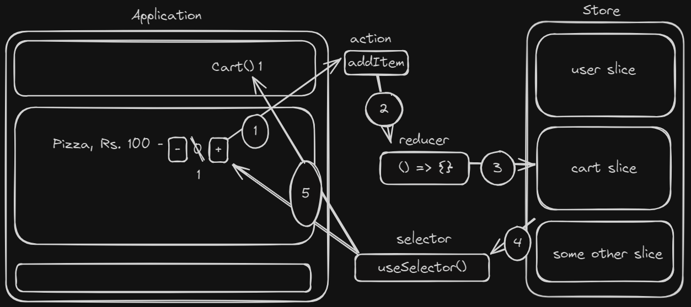

# React

<!-- To run this file, (ctrl + shift + v -> Preview in new tab, ctrl + k v -> Preview side-by-side)) -->

## Table of Contents

1. [What is `react` ?](#que-1-what-is-react-)
2. [What is the difference between library and framework ?](#que-2-what-is-the-difference-between-library-and-framework-)
3. [How to create your own mini `create-react-app` or How to create a react app without using CDN links or create-react-app command ?](#que-3-how-to-create-your-own-mini-create-react-app-)
4. [What is `JSX` ?](#que-4-what-is-jsx-)
5. [What is `Babel` ?](#que-5-what-is-babel-)
6. [What are `Components` ?](#que-6-what-are-components-)
7. [What is the difference between `Functional` and `Class` based components ?](#que-7-what-is-the-difference-between-functional-and-class-based-components-)
8. [What are `fragments` in react ?](#que-8-what-are-fragments-in-react-)
9. [Why style has two brackets ?](#que-9-why-style-has-two-brackets-)
10. [What is `DOM` ?](#que-10-what-is-dom-)
11. [How React works ?](#que-11-how-react-works-)
12. [What is React Fiber ?](#que-12-what-is-react-fiber-)
13. [What are `Keys` in React ?](#que-13-what-are-keys-in-react-)
14. [What is a `config driven UI` ?](#que-14-what-is-a-config-driven-ui-)
15. [What is the difference `default` import and `named` import ?](#que-15-what-is-the-difference-default-import-and-named-import-)
16. [What is `state` and `props` ?](#que-16-what-is-state-and-props-)
17. [What are `hooks` ?](#que-17-what-are-hooks-)
18. [What is `component lifecycle` in react ?](#que-18-what-is-component-lifecycle-in-react-)
19. [What is difference between `componentDidMount()` and `useEffect()` ?](#que-19-what-is-difference-between-componentdidmount-and-useeffect-)
20. [How react renders the page ?](#que-20-how-react-renders-the-page-)
21. [What is `shimmer UI` or `skeleton loading` ?](#que-21-what-is-shimmer-ui-or-skeleton-loading-)
22. [What is `custom hook` ?](#que-22-what-is-custom-hook-)
23. [What is `props drilling` ?](#que-23-what-is-props-drilling-)
24. [What is `redux` ?](#que-24-what-is-redux-)
25. [What is `HOC` ?](#que-25-what-is-hoc-)
26. [What is the difference between `custom hooks` and `hoc` ?](#que-26-what-is-the-difference-between-custom-hooks-and-hoc-)
27. [What is `pure component` ?](#que-27-what-is-pure-component-)
28. [How can you improve the `performance of application` ?](#que-28-how-can-you-improve-the-performance-of-application-)
29. [`SSR` vs `CSR`](#que-29-ssr-vs-csr)
30. [Some output questions](#que-30-some-output-question)


---

## Que-1: What is react ?
+ A JS library to build web and native user interfaces.
+ Helps to build `single page application`(no page reload while routing)

```html
<!DOCTYPE html>
<html lang="en">

<head>
  <meta charset="UTF-8">
  <meta name="viewport" content="width=device-width, initial-scale=1.0">
  <title>Document</title>
</head>

<body>
  <!-- Creating heading from HTML -->
  <div id="html">
    <h1>Hello World from HTML</h1>
  </div>

  <!-- Placeholder for JS heading -->
  <div id="js"></div>

  <script>
    const js = document.getElementById("js")
    const headingJS = document.createElement("h1")
    headingJS.innerHTML = "Hellow World from JS"
    js.appendChild(headingJS)
  </script>

  <!-- Adding react to basic html page -->

  <script
    crossorigin
    src="https://unpkg.com/react@18/umd/react.development.js">
  </script>
  <script
    crossorigin
    src="https://unpkg.com/react-dom@18/umd/react-dom.development.js">
  </script>

  <!-- This is the shortest code for React -->
  <!-- create 1 html file and add 2 cdn links, that's it -->

  <!-- Why 2 links ? -->
  <!-- one is for React & another is for ReactDOM -->
  <!-- ReactDOM is for running react in web(browser) -->
  <!-- In Browser(console) we can check for React and ReactDOM -->
</body>

</html>
```
```html
<body>
  <div id="root"></div>
  <!-- Creating heading with React -->
  <script>
    const heading = React.createElement("h1", {id: "title", className: "hello"}, "Hello World from React")
    // createElement(type, attribute, Content)

    // content can be an array if multiple elements to be appended inside one type.
    // <div>
    //   <h1></h1>
    //   <h1></h1>
    // </div>
    // const head1 = createElement("h1", {}, "Heading 1")
    // const head2 = createElement("h`", {}, "Heading 2")
    // const container = createElement("div", {}, [head1, head2])

    // createElement returns object with type: "h1"
    // second argument takes props as object

    // creating a root where React will render it's elements
    const root = ReactDOM.createRoot(document.getElementById("root"))

    root.render(heading)
    // render() will override the existing html inside the element with id="root" with whatever element you are passing. 
  </script>
</body>
```


## Que-2: What is the difference between library and framework ?
+ Library
  - Control Flow: Developer controls the flow.
  - Usage: Imported and used as needed.
  - Example: React (JavaScript), NumPy (Python).
+ Framework
  - Control Flow: Framework controls the flow.
  - Usage: Provides a structure for building applications.
  - Example: Angular (JavaScript), Django (Python)

## Que-3: How to create your own mini create-react-app ?

1. Create basic `index.html` file.
    ```html
    <!-- index.html -->
    <!DOCTYPE html>
    <html lang="en">

    <head>
      <meta charset="UTF-8">
      <meta name="viewport" content="width=device-width, initial-scale=1.0">
      <title>Document</title>
    </head>

    <body>
      <div id="root" />
      <script src="App.js"/>
    </body>
    </html>
    ```

2. If already created and react cdn links are present in index.html file, so remove those links.

3. Instead of writing js inside index.html file, create a seperate .js file.
    ```javascript
    // index.js
    const heading = React.createElement("h1", { id: "title", className: "hello" }, "Hello World from React")
    const root = ReactDOM.createRoot(document.getElementById("root"))
    root.render(heading)
    ```

    + We can deploy this code in production but this code is not optimized, no caching, no server, no asset handling, etc. So, how we get those things.

    + Using a bundler known as `Parcel`, what is `bundler`, A tool that processes and combines multiple JavaScript files and other assets into optimized output files for better performance.

    + So, ho we get this parcel into our code, by using something called `npm` which is used for installing libraries, packages.

    + But before installing parcel, we first need to setup a file which manages all our installed packages, libraries.

4. `npm init` command will create a new file file `package.json` which will manage project dependencies, define scripts, and ensure a consistent setup for development and production environments.

    + `npm init -y` skips the steps and setup package.json with default settings.

    ```javascript
    // package.json
    {
      "name": "learningreact",
      "version": "1.0.0",
      "main": "index.js", // index.html or if building production build, remove this line
      "scripts": {
        "test": "jest"
      },
      "author": "",
      "license": "ISC",
      "description": "",
    }
    ```

5. `npm i parcel -D` will install parcel but we need parcel only in development not in production, why, because In production, we serve the static files created by Parcel’s build process, so Parcel itself is not required (-D or --save-d will install package/lib as `devDependency`).

    + Whenever some lib/package is installed, `node_modules` and `package-lock.json` are created.

    + `node_modules` is a directory which is basically a database for NPM, where all your project's dependencies are installed, including libraries and packages listed in package.json.
      - Should not be pushed to git repo (beacuse it is large and can be installed using the info present in package-lock.json)

    + `package-lock.json` locks the versions of dependencies to ensure the same versions are installed across different environments.
      - Will store info of exact version and sub dependencies(`transitive dependency`) of installed dependencies.
      - Transitive Dependencies -> Parcel(Some dependency) has it's own dependencies which will have their own dependencies
      - Should be pushed to git repo, otherwise, there will be error like "Working on my machine but not woring in production".

    + In `package.json`, we will see `^` or `~` with version number.

    + `^(caret)` means auto upgrade to compatible version, work with minor version.
    
    + `~(tilde)` means approximately equivalent to version, work with patch updates.

6. Now time to install react in our own server(created by parcel), why ? becasue fetching from our server is faster than fetching from other's server(cdn).
    + `npm i react react-dom`
    + `npx parcel index.html` will create a server and create a development build and host it on the created server.
      - `npx` means don't install, just execute, what to execute ? `parcel`
      - but we need to tell parcel what our entry file is, i.e., `index.html`
      - It also creates 2 directories, `.parcel-cache` and `dist`
        - `.parcel-cache` is a space created for parcel to do following task(superpowers)
          - creates a server
          - fast subsequent bundling
          - Hot Module Replacement(HMR): When some file changes and as soon as you save that file, changes are reflected in browser, without refreshing. Uses `File Watched Algo`, written C++.
          - Minifying
          - Tree shaking: Removing unwanted files from installed lib which are not used.
          - Cleaning code (no console.log())
          - Caching
          - Compatible with older version of browser (`browserlist`)
        - `dist`
          - development build
          - keeps the file minified
    + Now, you will see error in console `Uncaught ReferenceError: React is not defined`
    + Why ? becasue we no longer have cdn links but yash, we have installed react and react-dom, so why it is not working.
    + Because we have to import those from 'react' and 'react-dom' lib which we installed now.
      ```javascript
      // index.js
      import React from "react"
      import ReactDOM from "react-dom/client"
      // import ReactDOM from "react-dom" // In previous version, this was running fine

      const heading = React.createElement("h1", { id: "title", className: "hello" }, "Hello World from React")
      const root = ReactDOM.createRoot(document.getElementById("root"))
      root.render(heading)
      ```
    + After importing and running again we will see, one more error `@parcel/transformer-js: Browser scripts cannot have imports or exports.`
    + Because when browser encounters `<script src="index.js" />`, browser treats it as script and in index.js we have 'import' but browser don't know what is import, so we need to tell browser that index.js is module instead of normal script.
      ```html
      <!-- index.html -->
      <!DOCTYPE html>
      <html lang="en">

      <head>
        <meta charset="UTF-8">
        <meta name="viewport" content="width=device-width, initial-scale=1.0">
        <title>Document</title>
      </head>

      <body>
        <div id="root" />
        <script src="index.js" type="module" />
      </body>
      </html>
      ```
7. It is `not feasible` to write `npx parcel index.html` all the time to run our application, so npm provides us scripts inside package.json, where we can write custom command to run our application.
    ```javascript
    // package.json
    {
      "scripts":{
        "start": "parcel index.html",
        "build": "parcel build index.html"
      }
      // dev or build can be given any name
    }
    ```
  + now for running application, execute `npm run start` or `npm start`

## Que-4: What is JSX ?
+ A syntax extension for JS that lets you write `HTML-like` markup inside a JS file.
+ Why HTML-like instead of HTML ? In jsx we have `className` instead of `class`, we have `tabIndex` instead of `tab-index`.
+ Created for better readability and easy to use.
+ `const heading = <h2>Hello World</h2>`
+ Can only have `one parent`.
+ `{}` inside this, any piece of `JS expression` will run.
+ JSX takes care of `XSS`.
+ XSS - Cross site scripting (XSS) is an attack in which an attacker injects malicious executable scripts into the code of a application or website.

## Que-5: What is babel ?
+ A JS compiler/transpiler which converts JSX to JS and sends to browser(browser don't understand JSX).
```javascript
// what we write
const heading = <h2>Hello World</h2>

// what babel does
const heading = React.createElement("h2", {}, "Hello World")

// JSX -> React.createElement -> HTML -> DOM
// It creates polyfill
```

+ It also ensures compatiblity to older version of browser using `browserlist` inside package.json.

## Que-6: What are components ?
+ Components are independent and reusable bits of code.
+ They serve the same purpose as JavaScript functions, but work in isolation and return React Element/JSX/Components.
Components isnide component is called `Composition of Component`
+ Generally, first letter is capital.
+ In order to render components, `root.render(<ComponentName />)`
+ 2 types of components: `Funtional` and `Class Based`.

## Que-7: What is the difference between functional and class based components ?
+ `Functional Components`
  - `const FC = () => {}`
  - Nothing but a simple JS funtion.
  - More performant due to direct function calls and Hooks.
  - Uses useState Hook for state management.
  - Learning curve is not that huge.(straight-forward)
  - Can use React.memo for optimization.
  - ```javascript
    const Header = () => {
      return <h1>Hello World</h1>
    }

    const Home = () => {
      return(
        <div>
          {Header()}   // Correct
          <Header />   // Correct
        </div>
      )
    }
    ```
+ `Class Components`
  - `class CC extends React.Component(){}`
  - ES6 classes that extend React.Component
  - Slightly less performant due to this context and lifecycle methods.
  - Uses this.state and this.setState for state management.
  - Higher learning curve due to the additional concepts of this context and lifecycle methods.
  - Can use PureComponent for optimization.

## Que-8: What are fragments in react ?
+ Fragments are `react components`
+ Used to group a list of children elements without adding extra nodes to the DOM.
+ `<></>` is also valid, but can't use keys with this syntax.

## Que-9: Why style has two brackets ?
+ `JSX` enables us to write JS inside {}.
+ `const styleObj = { color: "red", fontWeight: "bold" }`
+ `<div style=styleObj>` this won't work because styleObj is JS, so wrap inside {}.
+ `<div style={styleObj} />`

## Que-10: What is DOM ?

+ Documnet Object Model.
+ Blueprint of a webpage.
+ It represents the structure of a document(webpage) as a tree of objects.
+ Each node in this tree represents a DOM element.

## Que-11: How React works ?

+ React creates a virtual representation of the real DOM, called the `Virtual DOM`.
+ It is a lightweight copy of the actual DOM.
+ Suppose some changes occurs, then React identifies changes between different versions of the Virtual DOM, using `Diffing Algorithm`.
+ Based on the differences found by the diffing algorithm, React calculates the most efficient way to update the real DOM.
+ This process of updating the real DOM to match the Virtual DOM is called `reconciliation`.

## Que-12: What is React Fiber ?
+ Fiber is plain JS object.
+ Introduced in React v16+.
+ Replaced the old reconciler(stack) with fiber reconciler.
+ Fiber is asynchronus.
+ Primary goals of Fiber:
  + pause work and come back to it later.
  + assign priority to different types of work.
  + reuse previously completed work.
  + abort work if it's no longer needed. 
+ React processes fibers and en up with "finished work".
+ This work is later commited resulting in visible changes in the DOM.
+ This all happens in 2 phases:
+ Render Phase
  + Asynchronus
+ Commit Phase
  + Synchronus

## Que-13: What are keys in React ?

+ A string or a number that helps React to uniquely identifies it among other items in the same list.
+ Why keys are important ?
  1. **Analogy of Files on a Desktop(Example)**:
      - Imagine that files on your desktop didn’t have names. Instead, you’d refer to them by their order — the first file, the second file, and so on.
      - You could get used to it, but once you delete the first file, it would get confusing. The second file would become the first file, the third file would be the second file, and so on.
      - You'd have to restructure the whole folder, making it cumbersome and error-prone.
      - If we use unique names, this problem is solved. Each file retains its identity regardless of its position.

  2. **Same Concept with React Keys**:
      - In React, if we don't provide unique keys, React will re-render the whole list when there are changes, which is inefficient.
      - By providing unique keys, React can identify which items have changed, been added, or been removed. It will only re-render the modified parts, making the update process more efficient.

  3. **Best Practices**:
      - **Always Provide Keys**: Ensure that each element in a list has a unique key.
      - **Avoid Using Indexes as Keys**: Using array indexes as keys can lead to issues when the list order changes or when items are added or removed.

## Que-14: What is a config driven UI ?
+ A technique that allows you to create dynamic and customizable UIs without hard-coding them.
+ Depends on api response data.
+ Example - `Swiggy.com`: UI changes based on the user's city. It provides city-specific discounts, offers, and restaurant listings, all driven by configuration data received from APIs. (No hardcoding needed from front-end)

## Que-15: What is the difference default import and named import ?
+ `Default Import`

  ```javascript
  // 3 ways

  // src/App.jsx
  const App = () => {

  }
  export default App;

  // can also write "app" instead of "App"
  const app = () => {

  }
  export default app;

  // src/app.jsx
  const App = () => {

  }
  export default App;
  ```
  + Here, we can use App component in another files with whatever name.
    `import KuchBhi from "./App"`
  + only one export default per file.

+ `Named Export`
  ```javascript
  export const App = () => {

  }
  ```
  + It's like destructuring a file. `import { App } from "./App"`
  + Can be multiple in a single file(just like JS funtions)

## Que-16: What is state and props ?

+ `State`

  + React don't know anything about local variable.(don't track local variables)
  + To keep the variables in-sync with react so that React knows which variable is changing when, `state variable` was introduced.
  + State is an object that represents the parts of the app that can change.
  + React keeps track of state variable and triggers re-renders when they change.
  + Can only be created using hooks(in functional components) or in constructor(in class component).

+ `Props`
  + Properties.
  + Can be used in composition of component(send data from parent comp to child comp.) 
  + Read-only and immutable in the component which is receiving props.

  ```javascript
  // App.js
  const App = () => {
    const [count, setCount] = useState(0) // state variable
    return(
      <Header count={count} /> // sending count as "props"
      <button onClick={() => setCount(count + 1)}></button>
    )
  }

  // Header.js
  export const Header = (count) => { // receiving count as "props"
    return <b>{count}</>
  }
  ```

## Que-17: What are hooks ?

+ Normal JS funtions.
+ Can change state, perform side effects, access lifecycle methods and tells react to re-render.
+ Only present in funtional component.

## Que-18: What is component lifecycle in react ?
  + Componet Lifecycle goes through 3 stages:
  + `Mounting`
    + Done in 2 phase - Render and Commit
    + Initial stage where states and props are initialised.(constructor)
    + Prepares and returns the React elements to be rendered.(render)

  + `Updateing`
    + Done in 2 phase - Render and Commit
    + When the state of a component is updated and the application is re-rendered.
  
  + `Unmounting`
    + Done in Commit phase.
    + Final step of the component lifecycle where the component is removed from the page.
  

  + [See some examples and try to answer what will be printed for better understanding from 3 to 6](#3)

## Que-19: What is difference between componentDidMount() and useEffect() ?
+ `componentDidMount()`
  + Class component lifecycle method.
  + Is called once after the initial render.
  + Can be asynchronus. (Because we don't need any cleanup function here, handled be componentWillUnmount())
+ `useEffect()`
  + Functional Component hook.
  + Accepts 2 paramteres - callback function and dependency array.
  + Depening on dependency array, can be called in different ways.
    ```javascript
    useEffect(cb) // will be called after initial render and after every render
    useEffect(cb, []) // will be called once after initial render 

    const [count, setCount] = useState(0)
    useEffect(cb, [count]) // will be called after initial render and whenever count changes.
    // count value needs to be initialised with useState
    ```
  + Cannot be asynchronus, because it expects either undefined or a cleanup function.
  + If made async then it cannot directly return this cleanup function because async returns a promise.

## Que-20: How react renders the page ?
+ Rendering is done in 2 phase:
  + `Render Phase`
    + What changes need to be made to the virtual DOM.
    + Also known as the `Reconciliation phase`
    + constructor(initialisation) and render(basic html, JSX to js with the help of babel)
  + `Commit Phase`
    +  Applies changes to the actual DOM and runs side effects.
    + componentDidMount(), componentDidUpdate, componentWillUnmount() in class component
    + useEffect(cb, []), useEffect(cb, []), useEffect(cb, [somevariable]) in functional component

## Que-21: What is shimmer UI or skeleton loading ?

+ A design used to improve the user expereince by showing placeholders instead of a loader for asynchronus tasks.


## Que-22: What is custom hook ?

+ Normal JS function created by developers for better readbility, easy to debug and reusability.
+ Why not create functions instead of hooks ? Because functions do not support hooks(lifecycle) and can't use state inside functions.

## Que-23: What is props drilling ?
+ Process of passing props from a parent component down to a deeply nested child component through several intermediary components.
+ These intermediary components may not need those props.
+ Solution: `useContext` or `redux` or `recoil`

## Que-24: What is redux ?
+ Redux is a state management library that manages the state of application.

+ Key Concepts:
  + `Store`: Centralized state for the entire application.
  + `Slice`: Logical fragments of the store.
  + Store can't be modified directly.
  + `Selector`: Reads data from the store.(`Subscribing from store`)
  + `Action`: Describes what happened.
  + `Reducer`: Updates the state based on the action.(Pure Functions)

+ How redux works ?
    1. User Action - A user does something (like clicking a button).

    2. Action Created - This action is a plain object that describes what happened (e.g., adding an item).

    3. Dispatch Action - The action is sent to Redux using `dispatch()`.

    4. Reducer Handles Action - A reducer takes the current state and action to produce a new state.

    5. Update Store - The Redux store saves the new state.

    6. UI Updates - React components read the new state from the store and update the UI.

    

+ Steps to integrate redux:
  1. Create slices as per requirement using `createSlice()` which takes a object with "name", "initialState" and "reducers".
      1. `reducers` -> object which will have mutiple reducers.
      2. `reducer` -> funtion which will update the store by taking `state` and `action` as parameter. 
  2. After creating slice, export reducer and actions.
      1. export default `sliceName.reducer` for reducer.
      2. export const { actionName1(name of reducer), actionName2 } = `sliceName.actions` for actions.
          ```javascript
          const cartSlice = createSlice({
            name: "cart",
            initialState: { cartItems: ["Mobile", "Laptop"] },
            reducers: {
              addItem: (state, action) => {
                state.items.push(action.payload)
              },
              clearCart: (state) => {
                state.items = []
              }
            }
          })

          export const { addItem, clearCart } = cartSlice.actions

          export default cartSlice.reducer
          ```
  3. Create a store using `configureStore()` provided by RTK (store.js).
      ```javascript
      const store = configureStore({
        reducer: {
          cart: cartSlice // exported from cartSlice.reducer
        }
      })
      export default store
      ```
  4. Wrap whole application(index.js or App.js) using `Provider` from "react-redux" which connects react and redux by passing `store` as props.
      - `<Provider store={store}><App /></Provider>`

  5. For subscribing or reading from store, use `useSelector()` from "react-redux".
      - `const { cartItems } = useSelector(store => store.cart)`
      - Do not use `const store = useSelector(store => store)`, why ?
      - Because if store will change, whole component will get re-rendered.
  6. For updating value, use `useDispatch` from "react-redux"
      - `const dispatch(addItem("PS5"))`

## Que-25: What is HOC ?
+ Higher Order Component.
+ Functions that take a component and return a new component with additional props or functionality.

## Que-26: What is the difference between custom hooks and hoc ?
<table>
<tr>
<th>Custom Hooks</th>
<th>HOC</th>
</tr>
<tr>
<td>
  <ul>
    <li>Returns a value</li>
    <li>No nesting is created</li>
    <li>Developer friendly - easy to read and understand</li>
  </ul>
</td>
<td>
 <ul>
    <li>Returns JSX</li>
    <li>Creates an additional nesting in DOM tree</li>
    <li>Difficult to read ad understand</li>
  </ul>
</td>
</tr>
</table>

## Que-27: What is pure component ?
+ A React component that only re-renders when its props or state have changed.
+ In class component, React.PureComponent automatically implements `shouldComponentUpdate` with a shallow comparison of this.props and this.state
    ```javascript
    import React from 'react';

    class MyPureComponent extends React.PureComponent {
      render() {
        return <div>{this.props.data}</div>;
      }
    }
    ```
+ In funtional component, React.memo is a higher-order component for functional components that performs a shallow comparison of props to avoid unnecessary re-renders.
    ```javascript
    import React from 'react';

    const MyPureComponent = React.memo(({ data }) => {
      return <div>{data}</div>;
    });
    ```

## Que-28: How can you improve the performance of application ? 
+ Use of bundler
+ Implement lazy loading for Images as well as components using Suspense.(code splitting, chunking)
+ Debounce and throttle.
+ Memoize the component which is heavy and don't want to re-render again and again.
+ Efficient use of key.
+ Serve assets from a CDN to reduce latency and load times.

## Que-29: SSR vs CSR
+ `CSR`
    + Client side rendering.
    + CSR involves rendering the application directly in the browser using JS.
    + The server sends a minimal HTML file(index.html) to the browser.
    + The browser downloads the JS files specified in the HTML file.
    + JS files execute and render the content dynamically in the browser.
    + Advantages:
        + Highly interactive and fast user experience after initial load.
        + Less load on the server.
    + Disadvantags:
        + Slower initial load time because the browser needs to download and execute JS.
        + Not as good for [SEO](https://www.freecodecamp.org/news/how-to-make-seo-friendly-react-apps/)

+ `SSR`
    + Server side rendering.
    + SSR involves rendering the application on the server before sending the fully rendered HTML to the browser.
    + The server processes the request, renders the full HTML for the page, and sends it to the browser(client).
    + The browser downloads JS files, but their role here is to `hydrate` the page (i.e., make the static HTML interactive) rather than to render the content from scratch.
    + Advantages:
        + Faster initial load.
        + Better for [SEO](https://www.freecodecamp.org/news/how-to-make-seo-friendly-react-apps/).
    + Disadvantages:
        + More work for the server.
        + If the user’s internet connection is slow or the server is slow or overloaded, it takes more time to generate and send the HTML.

## Que-30: Some output question
  ## `1`
  ```html
  <!DOCTYPE html>
  <html lang="en">

  <head>
    <meta charset="UTF-8">
    <meta name="viewport" content="width=device-width, initial-scale=1.0">
    <title>Document</title>
  </head>

  <body>
    <div id="root">
      <h1 id="test">H</h1>
      <h1 id="test">E</h1>
      <h1 id="test">L</h1>
      <h1 id="test">L</h1>
      <h1 id="test">O</h1>
    </div>

    <script
      crossorigin
      src="https://unpkg.com/react@18/umd/react.development.js">
    </script>
    <script
      crossorigin
      src="https://unpkg.com/react-dom@18/umd/react-dom.development.js">
    </script>

    <script>
      const heading = React.createElement("h1", {id: "title", className: "hello"}, "Hello World from React")
      const root = ReactDOM.createRoot(document.getElementById("root"))
      root.render(heading)
    </script>
  </body>
  </html>
  ```
  `Output`
  ```
  H
  E
  L
  L
  O
  // HELLO will be rendered first because it takes time to install react
  // After some miliseconds Hello World will be rendered
  Hello World from React
  ```

  ## `2`
  ```html
  <!DOCTYPE html>
  <html lang="en">

  <head>
    <meta charset="UTF-8">
    <meta name="viewport" content="width=device-width, initial-scale=1.0">
    <title>Document</title>
  </head>

  <body>
    <div id="root">
      <span>Not Rendered</span>
    </div>

    <script>
      const heading = React.createElement("h1", {id: "title", className: "hello"}, "Hello World from React")
      const root = ReactDOM.createRoot(document.getElementById("root"))
      root.render(heading)
    </script>

    <script
      crossorigin
      src="https://unpkg.com/react@18/umd/react.development.js">
    </script>
    <script
      crossorigin
      src="https://unpkg.com/react-dom@18/umd/react-dom.development.js">
    </script>

  </body>
  </html>
  ```
  `Output`
  ```
  Not rendered
  // In Console
  Uncaught ReferenceError: React is not defined
  ```

  ## `3`
  ```javascript
  import React from "react"

  class About extends React.Component{
    constructor(props){
      super(props)
      console.log("Parent - Constructor")
    }

    componentDidMount(){
      console.log("Parent - ComponentDidMount")
    }

    render(){
      console.log("Parent - Render")
      return (
        <div>
          <h2>About</h2>
        </div>
      )
    }
  }

  export default About
  ```
  `Output`
  ```
  Parent - Constructor
  Parent - Render
  Parent - ComponentDidMount
  ```

  ## `4`
  <table>
  <tr>
  <th>About.jsx</th>
  <th>Profile.jsx</th>
  </tr>
  <tr>
  <td>

  ```javascript
  import React from "react"
  import Profile from "./Profile"

  class About extends React.Component{
    constructor(props){
      super(props)
      console.log("Parent - Constructor")
    }

    componentDidMount(){
      console.log("Parent - ComponentDidMount")
    }

    render(){
      console.log("Parent - Render")
      return (
        <div>
          <h2>About</h2>
          <Profile />
        </div>
      )
    }
  }

  export default About
  ```

  </td>
  <td>

  ```javascript
  import React from "react"

  class Profile extends React.Component{
    constructor(props){
      super(props)
      console.log("Child: 1 - Constructor")
    }

    componentDidMount(){
      console.log("Child: 1 - ComponentDidMount")
    }

    render(){
      console.log("Child: 1 - Render")
      return <div>Profile Class Component</div>
    }
  }

  export default Profile;
  ```

  </td>
  </tr>
  </table>

  `Output`
  ```
  Parent - Constructor
  Parent - Render
  Child: 1 - Constructor
  Child: 1 - Render
  Child: 1 - ComponentDidMount
  Parent - ComponentDidMount
  ```

  ## `5`
  <table>
  <tr>
  <th>About.jsx</th>
  <th>Profile.jsx</th>
  </tr>
  <tr>
  <td>

  ```javascript
  import React from "react"
  import Profile from "./Profile"

  class About extends React.Component{
    constructor(props){
      super(props)
      console.log("Parent - Constructor")
    }

    componentDidMount(){
      console.log("Parent - ComponentDidMount")
    }

    render(){
      console.log("Parent - Render")
      return (
        <div>
          <h2>About</h2>
          <Profile />
        </div>
      )
    }
  }

  export default About
  ```

  </td>
  <td>

  ```javascript
  import React from "react"

  class Profile extends React.Component{
    constructor(props){
      super(props)
      console.log("Child: 1 - Constructor")
    }

    async componentDidMount(){
      console.log("Child: 1 - ComponentDidMount")
      await new Promise(function (resolve, reject){
        setTimoue(() => resolve(), 2000)
      })
      console.log("Data received") 
    }

    render(){
      console.log("Child: 1 - Render")
      return <div>Profile Class Component</div>
    }
  }

  export default Profile;
  ```

  </td>
  </tr>
  </table>


  `Output`
  ```
  Parent - Constructor
  Parent - Render
  Child: 1 - Constructor
  Child: 1 - Render
  Child: 1 - ComponentDidMount
  Parent - ComponentDidMount
  Data received
  ```

  ## `6`
  <table>
  <tr>
  <th>About.jsx</th>
  <th>Profile.jsx</th>
  <th>Profile2.jsx</th>
  </tr>
  <tr>
  <td>

  ```javascript
  import React from "react"
  import Profile from "./Profile"
  import Profile2 from "./Profile2"

  class About extends React.Component{
    constructor(props){
      super(props)
      console.log("Parent - Constructor")
    }

    componentDidMount(){
      console.log("Parent - ComponentDidMount")
    }

    render(){
      console.log("Parent - Render")
      return (
        <div>
          <h2>About</h2>
          <Profile />
          <Profile2 />
        </div>
      )
    }
  }

  export default About
  ```

  </td>
  <td>

  ```javascript
  import React from "react"

  class Profile extends React.Component{
    constructor(props){
      super(props)
      console.log("Child: 1 - Constructor")
    }

    componentDidMount(){
      console.log("Child: 1 - ComponentDidMount")
    }

    render(){
      console.log("Child: 1 - Render")
      return <div>Profile Class Component</div>
    }
  }

  export default Profile;
  ```

  <td>

  ```javascript
  import React from "react"

  class Profile2 extends React.Component{
    constructor(props){
      super(props)
      console.log("Child: 2 - Constructor")
    }

    componentDidMount(){
      console.log("Child: 2 - ComponentDidMount")
    }

    render(){
      console.log("Child: 2 - Render")
      return <div>Profile Class Component</div>
    }
  }

  export default Profile2;
  ```

  </td>
  </td>
  </tr>
  </table>

  `Output`
  ```
  Parent - Constructor
  Parent - Render
  Child: 1 - Constructor
  Child: 1 - Render
  Child: 2 - Constructor
  Child: 2 - Render
  Child: 1 - ComponentDidMount
  Child: 2 - ComponentDidMount
  Parent - ComponentDidMount
  ```